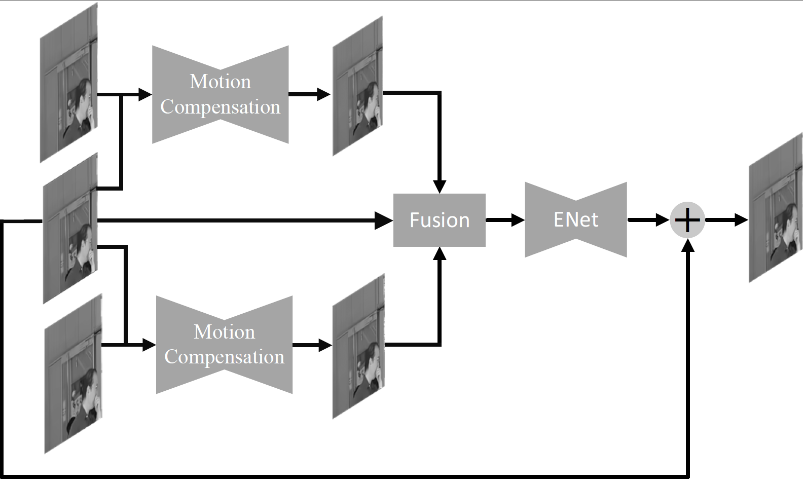
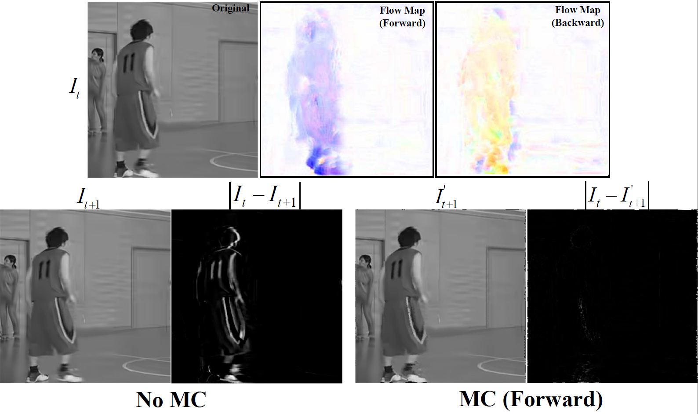

TensorFlow implementation of "Enhancing Quality for VVC Compressed Videos by Jointly Exploiting Spatial Details and Temporal Structure"


[arXiv](http://arxiv.org/pdf/1811.2555181)

## Framework

<p align="center">
     <br />
    <em> The proposed quality enhancement network</em>
</p>

## Motion Compensation (MC)
<p align="center">
     <br />
    <em> Top: flow map estimated relating the original frame. Bottom: the consecutive frames without and with motion
compensation (No MC and MC). </em>
</p>

## Installation
The code was developed using Python 3.6 & TensorFlow 1.3 & CUDA 8.0. 

## Code v1.0
Currently, we release our research code for training and testing. It should produce the same results as in the paper under LD configurations.
## Training && Testing
* It's easy to understand training or testing functions and to train or test your own data.
* An example of test usage is shown as follows:
```bash 
python CUDA_VISIBLE_DEVICES=0 SDTS_test.py
```

## Video Results
* [Here](http://arxiv.org/pdf/1811.2555181) we provide quality enhancement results of compressed video for 18 widely used sequences for visual and quantitative comparisons.
## Citation

If you use any part of our code, or our method is useful for your research, please consider citing:

```
@article{SDTS2019,
  author={Xiandong, Meng and Xuan, Deng and Shuyuan, Zhu and Bing, Zeng},
  title={Enhancing Quality for VVC Compressed Videos by Jointly Exploiting Spatial Details and Temporal Structure},
  journal={arXiv:1811.2555181},
  year={2019}
}
```
## Contact
We are glad to hear if you have any suggestions and questions. 
Please send email to xmengab@connect.ust.hk
